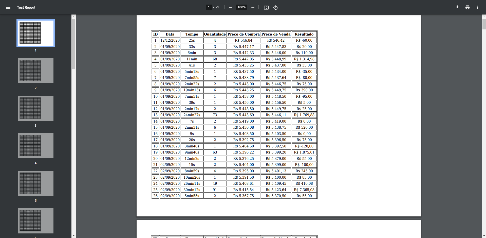

<h4 align="center">
  Projeto mPDF + CodeIgniter
</h4>

<p align="center">
  :rocket: <a href="#rocket-tecnologias">Tecnologias</a>&nbsp;&nbsp;&nbsp;|&nbsp;&nbsp;&nbsp;
  💻 <a href="#-projeto">Projeto</a>&nbsp;&nbsp;&nbsp;|&nbsp;&nbsp;&nbsp;
  🔖 <a href="#-como-executar">Como Executar</a>&nbsp;&nbsp;&nbsp;
</p>

## :rocket: Tecnologias

Este projeto contém as seguintes tecnologias:

- [CodeIgniter](https://codeigniter.com/)
- [Composer](https://getcomposer.org/)
- [mPDF](https://mpdf.github.io/)
- [MySQL](https://www.mysql.com/)

## 💻 Projeto

Aqui foi realizado um projeto teste utilizando o mPDF e o CodeIgniter para gerar um relatório de listagem simples integrado com um banco de dados MySQL.

## 🔖 Como Executar

#### Clonando o projeto
```sh

git clone https://github.com/ffzanini/mpdf-report-mysql.git

```
#### Execução do projeto
<p>- Na pasta 'config/database', coloque corretamente os dados para acessar seu banco de dados;</p>
<p>- Configure corretamente a model 'Test_model' para que faça a chamada da sua tabela do banco de dados;</p>
<p>- Configure a view "test" para que chame corretamente os campos da sua tabela selecionada.</p>

## Resultado
<h1 align="center">
    
</h1>

## License
<p align="justify">
This project is licensed under the <a href="https://github.com/ffzanini/mpdf-report-mysql/blob/master/LICENSE">MIT<a/> License
</p>
    
---

Feito com 💙 by Felipe Frantz Zanini
